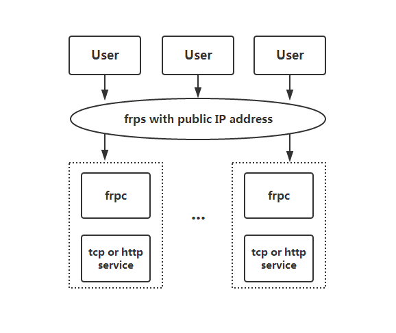

# frp

[README](README.md) | [中文文档](README_zh.md)

## What is frp?

frp is a fast reverse proxy to help you expose a local server behind a NAT or firewall to the internet.

## What can I do with frp?

* Expose any http service behind a NAT or firewall to the internet by a server with public IP address(Name-based Virtual Host Support).
* Expose any tcp service behind a NAT or firewall to the internet by a server with public IP address.
* Inspect all http requests/responses that are transmitted over the tunnel(future).

## Status

frp is under development and you can try it with latest release version.Master branch for releasing stable version when dev branch for developing.

**We may change any protocol and can't promise backward compatible before version 1.x.**

## Quick Start

Read the [QuickStart](doc/quick_start_en.md)

[Tcp port forwarding](doc/quick_start_en.md#tcp-port-forwarding)

[Http port forwarding and Custom domain binding](doc/quick_start_en.md#http-port-forwarding-and-custom-domains-binding)

## Architecture

## Contributing

Interested in getting involved? We would love to help you!

* Take a look at our [issues list](https://github.com/fatedier/frp/issues) and consider submitting a patch
* If you have some wanderful ideas, send email to fatedier@gmail.com.

## Contributors

* [fatedier](https://github.com/fatedier)
* [Hurricanezwf](https://github.com/Hurricanezwf)
* [vashstorm](https://github.com/vashstorm)
