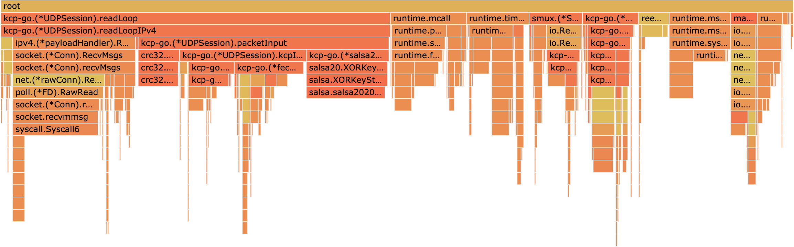

[![GoDoc][1]][2] [![Powered][9]][10] [![MIT licensed][11]][12] [![Build Status][3]][4] [![Go Report Card][5]][6] [![Coverage Statusd][7]][8]

[1]: https://godoc.org/github.com/xtaci/kcp-go?status.svg
[2]: https://godoc.org/github.com/xtaci/kcp-go
[3]: https://travis-ci.org/xtaci/kcp-go.svg?branch=master
[4]: https://travis-ci.org/xtaci/kcp-go
[5]: https://goreportcard.com/badge/github.com/xtaci/kcp-go
[6]: https://goreportcard.com/report/github.com/xtaci/kcp-go
[7]: https://codecov.io/gh/xtaci/kcp-go/branch/master/graph/badge.svg
[8]: https://codecov.io/gh/xtaci/kcp-go
[9]: https://img.shields.io/badge/KCP-Powered-blue.svg
[10]: https://github.com/skywind3000/kcp
[11]: https://img.shields.io/badge/license-MIT-blue.svg
[12]: LICENSE

## Introduction

**kcp-go** is a **Production-Grade Reliable-UDP** library for [golang](https://golang.org/). 

This library intents to provide a **smooth, resilient, ordered, error-checked and anonymous** delivery of streams over **UDP** packets, it has been battle-tested with opensource project [kcptun](https://github.com/xtaci/kcptun). Millions of devices(from low-end MIPS routers to high-end servers) have deployed **kcp-go** powered program in a variety of forms like **online games, live broadcasting, file synchronization and network acceleration**.

[Lastest Release](https://github.com/xtaci/kcp-go/releases)

## Features

1. Designed for **Latency-sensitive** scenarios.
1. **Cache friendly** and **Memory optimized** design, offers extremely **High Performance** core.
1. Handles **>5K concurrent connections** on a single commodity server.
1. Compatible with [net.Conn](https://golang.org/pkg/net/#Conn) and [net.Listener](https://golang.org/pkg/net/#Listener), a drop-in replacement for [net.TCPConn](https://golang.org/pkg/net/#TCPConn).
1. [FEC(Forward Error Correction)](https://en.wikipedia.org/wiki/Forward_error_correction) Support with [Reed-Solomon Codes](https://en.wikipedia.org/wiki/Reed%E2%80%93Solomon_error_correction)
1. Packet level encryption support with [AES](https://en.wikipedia.org/wiki/Advanced_Encryption_Standard), [TEA](https://en.wikipedia.org/wiki/Tiny_Encryption_Algorithm), [3DES](https://en.wikipedia.org/wiki/Triple_DES), [Blowfish](https://en.wikipedia.org/wiki/Blowfish_(cipher)), [Cast5](https://en.wikipedia.org/wiki/CAST-128), [Salsa20]( https://en.wikipedia.org/wiki/Salsa20), etc. in [CFB](https://en.wikipedia.org/wiki/Block_cipher_mode_of_operation#Cipher_Feedback_.28CFB.29) mode, which generates completely anonymous packet.
1. Only **A fixed number of goroutines** will be created for the entire server application, costs in **context switch** between goroutines have been taken into consideration.
1. Compatible with [skywind3000's](https://github.com/skywind3000) C version with various improvements.
1. Platform-dependent optimizations: [sendmmsg](http://man7.org/linux/man-pages/man2/sendmmsg.2.html) and [recvmmsg](http://man7.org/linux/man-pages/man2/recvmmsg.2.html) were expoloited for linux.

## Documentation

For complete documentation, see the associated [Godoc](https://godoc.org/github.com/xtaci/kcp-go).

## Specification


```
NONCE:
  16bytes cryptographically secure random number, nonce changes for every packet.
  
CRC32:
  CRC-32 checksum of data using the IEEE polynomial
 
FEC TYPE:
  typeData = 0xF1
  typeParity = 0xF2
  
FEC SEQID:
  monotonically increasing in range: [0, (0xffffffff/shardSize) * shardSize - 1]
  
SIZE:
  The size of KCP frame plus 2
```

```
+-----------------+
| SESSION         |
+-----------------+
| KCP(ARQ)        |
+-----------------+
| FEC(OPTIONAL)   |
+-----------------+
| CRYPTO(OPTIONAL)|
+-----------------+
| UDP(PACKET)     |
+-----------------+
| IP              |
+-----------------+
| LINK            |
+-----------------+
| PHY             |
+-----------------+
(LAYER MODEL OF KCP-GO)
```


## Examples

1. [simple examples](https://github.com/xtaci/kcp-go/tree/master/examples)
2. [kcptun client](https://github.com/xtaci/kcptun/blob/master/client/main.go)
3. [kcptun server](https://github.com/xtaci/kcptun/blob/master/server/main.go)

## Benchmark
```
  Model Name:	MacBook Pro
  Model Identifier:	MacBookPro14,1
  Processor Name:	Intel Core i5
  Processor Speed:	3.1 GHz
  Number of Processors:	1
  Total Number of Cores:	2
  L2 Cache (per Core):	256 KB
  L3 Cache:	4 MB
  Memory:	8 GB
```
```
$ go test -v -run=^$ -bench .
beginning tests, encryption:salsa20, fec:10/3
goos: darwin
goarch: amd64
pkg: github.com/xtaci/kcp-go
BenchmarkSM4-4                 	   50000	     32180 ns/op	  93.23 MB/s	       0 B/op	       0 allocs/op
BenchmarkAES128-4              	  500000	      3285 ns/op	 913.21 MB/s	       0 B/op	       0 allocs/op
BenchmarkAES192-4              	  300000	      3623 ns/op	 827.85 MB/s	       0 B/op	       0 allocs/op
BenchmarkAES256-4              	  300000	      3874 ns/op	 774.20 MB/s	       0 B/op	       0 allocs/op
BenchmarkTEA-4                 	  100000	     15384 ns/op	 195.00 MB/s	       0 B/op	       0 allocs/op
BenchmarkXOR-4                 	20000000	        89.9 ns/op	33372.00 MB/s	       0 B/op	       0 allocs/op
BenchmarkBlowfish-4            	   50000	     26927 ns/op	 111.41 MB/s	       0 B/op	       0 allocs/op
BenchmarkNone-4                	30000000	        45.7 ns/op	65597.94 MB/s	       0 B/op	       0 allocs/op
BenchmarkCast5-4               	   50000	     34258 ns/op	  87.57 MB/s	       0 B/op	       0 allocs/op
Benchmark3DES-4                	   10000	    117149 ns/op	  25.61 MB/s	       0 B/op	       0 allocs/op
BenchmarkTwofish-4             	   50000	     33538 ns/op	  89.45 MB/s	       0 B/op	       0 allocs/op
BenchmarkXTEA-4                	   30000	     45666 ns/op	  65.69 MB/s	       0 B/op	       0 allocs/op
BenchmarkSalsa20-4             	  500000	      3308 ns/op	 906.76 MB/s	       0 B/op	       0 allocs/op
BenchmarkCRC32-4               	20000000	        65.2 ns/op	15712.43 MB/s
BenchmarkCsprngSystem-4        	 1000000	      1150 ns/op	  13.91 MB/s
BenchmarkCsprngMD5-4           	10000000	       145 ns/op	 110.26 MB/s
BenchmarkCsprngSHA1-4          	10000000	       158 ns/op	 126.54 MB/s
BenchmarkCsprngNonceMD5-4      	10000000	       153 ns/op	 104.22 MB/s
BenchmarkCsprngNonceAES128-4   	100000000	        19.1 ns/op	 837.81 MB/s
BenchmarkFECDecode-4           	 1000000	      1119 ns/op	1339.61 MB/s	    1606 B/op	       2 allocs/op
BenchmarkFECEncode-4           	 2000000	       832 ns/op	1801.83 MB/s	      17 B/op	       0 allocs/op
BenchmarkFlush-4               	 5000000	       272 ns/op	       0 B/op	       0 allocs/op
BenchmarkEchoSpeed4K-4         	    5000	    259617 ns/op	  15.78 MB/s	    5451 B/op	     149 allocs/op
BenchmarkEchoSpeed64K-4        	    1000	   1706084 ns/op	  38.41 MB/s	   56002 B/op	    1604 allocs/op
BenchmarkEchoSpeed512K-4       	     100	  14345505 ns/op	  36.55 MB/s	  482597 B/op	   13045 allocs/op
BenchmarkEchoSpeed1M-4         	      30	  34859104 ns/op	  30.08 MB/s	 1143773 B/op	   27186 allocs/op
BenchmarkSinkSpeed4K-4         	   50000	     31369 ns/op	 130.57 MB/s	    1566 B/op	      30 allocs/op
BenchmarkSinkSpeed64K-4        	    5000	    329065 ns/op	 199.16 MB/s	   21529 B/op	     453 allocs/op
BenchmarkSinkSpeed256K-4       	     500	   2373354 ns/op	 220.91 MB/s	  166332 B/op	    3554 allocs/op
BenchmarkSinkSpeed1M-4         	     300	   5117927 ns/op	 204.88 MB/s	  310378 B/op	    6988 allocs/op
PASS
ok  	github.com/xtaci/kcp-go	50.349s
```


## Typical Flame Graph


## Key Design Considerations

1. slice vs. container/list

`kcp.flush()` loops through the send queue for retransmission checking for every 20ms(interval).

I've wrote a benchmark for comparing sequential loop through *slice* and *container/list* here:

https://github.com/xtaci/notes/blob/master/golang/benchmark2/cachemiss_test.go

```
BenchmarkLoopSlice-4   	2000000000	         0.39 ns/op
BenchmarkLoopList-4    	100000000	        54.6 ns/op
```

List structure introduces **heavy cache misses** compared to slice which owns better **locality**, 5000 connections with 32 window size and 20ms interval will cost 6us/0.03%(cpu) using slice, and 8.7ms/43.5%(cpu) for list for each `kcp.flush()`.

2. Timing accuracy vs. syscall clock_gettime

Timing is **critical** to **RTT estimator**, inaccurate timing leads to false retransmissions in KCP, but calling `time.Now()` costs 42 cycles(10.5ns on 4GHz CPU, 15.6ns on my MacBook Pro 2.7GHz). 

The benchmark for time.Now() lies here:

https://github.com/xtaci/notes/blob/master/golang/benchmark2/syscall_test.go

```
BenchmarkNow-4         	100000000	        15.6 ns/op
```

In kcp-go, after each `kcp.output()` function call, current clock time will be updated upon return, and for a single `kcp.flush()` operation, current time will be queried from system once. For most of the time, 5000 connections costs 5000 * 15.6ns = 78us(a fixed cost while no packet needs to be sent), as for 10MB/s data transfering with 1400 MTU, `kcp.output()` will be called around 7500 times and costs 117us for `time.Now()` in **every second**.

3. Memory management

Primary memory allocation are done from a global buffer pool xmit.Buf, in kcp-go, when we need to allocate some bytes, we can get from that pool, and a fixed-capacity 1500 bytes(mtuLimit) will be returned, the rx queue, tx queue and fec queue all receive bytes from there, and they will return the bytes to the pool after using to prevent unnecessary zer0ing of bytes. The pool mechanism maintained a high watermark for slice objects, these in-flight objects from the pool will survive from the perodical garbage collection, meanwhile the pool kept the ability to return the memory to runtime if in idle.

4. Information security

kcp-go is shipped with builtin packet encryption powered by various block encryption algorithms and works in [Cipher Feedback Mode](https://en.wikipedia.org/wiki/Block_cipher_mode_of_operation#Cipher_Feedback_(CFB)), for each packet to be sent, the encryption process will start from encrypting a [nonce](https://en.wikipedia.org/wiki/Cryptographic_nonce) from the [system entropy](https://en.wikipedia.org/wiki//dev/random), so encryption to same plaintexts never leads to a same ciphertexts thereafter.

The contents of the packets are completely anonymous with encryption, including the headers(FEC,KCP), checksums and contents. Note that, no matter which encryption method you choose on you upper layer, if you disable encryption, the transmit will be insecure somehow, since the header is ***PLAINTEXT*** to everyone it would be susceptible to header tampering, such as jamming the *sliding window size*, *round-trip time*, *FEC property* and *checksums*. ```AES-128``` is suggested for minimal encryption since modern CPUs are shipped with [AES-NI](https://en.wikipedia.org/wiki/AES_instruction_set) instructions and performs even better than `salsa20`(check the table above).

Other possible attacks to kcp-go includes: a) [traffic analysis](https://en.wikipedia.org/wiki/Traffic_analysis), dataflow on specific websites may have pattern while interchanging data, but this type of eavesdropping has been mitigated by adapting [smux](https://github.com/xtaci/smux) to mix data streams so as to introduce noises, perfect solution to this has not appeared yet, theroretically by shuffling/mixing messages on larger scale network may mitigate this problem.  b) [replay attack](https://en.wikipedia.org/wiki/Replay_attack), since the asymmetrical encryption has not been introduced into kcp-go for some reason, capturing the packets and replay them on a different machine is possible, (notice: hijacking the session and decrypting the contents is still *impossible*), so upper layers should contain a asymmetrical encryption system to guarantee the authenticity of each message(to process message exactly once), such as HTTPS/OpenSSL/LibreSSL, only by signing the requests with private keys can eliminate this type of attack. 

## Connection Termination

Control messages like **SYN/FIN/RST** in TCP **are not defined** in KCP, you need some **keepalive/heartbeat mechanism** in the application-level. A real world example is to use some **multiplexing** protocol over session, such as [smux](https://github.com/xtaci/smux)(with embedded keepalive mechanism), see [kcptun](https://github.com/xtaci/kcptun) for example.

## FAQ

Q: I'm handling >5K connections on my server, the CPU utilization is so high.

A: A standalone `agent` or `gate` server for running kcp-go is suggested, not only for CPU utilization, but also important to the **precision** of RTT measurements(timing) which indirectly affects retransmission. By increasing update `interval` with `SetNoDelay` like `conn.SetNoDelay(1, 40, 1, 1)` will dramatically reduce system load, but lower the performance.

Q: When should I enable FEC?

A: Forward error correction is critical to long-distance transmission, because a packet loss will lead to a huge penalty in time. And for the complicated packet routing network in modern world, round-trip time based loss check will not always be efficient, the big deviation of RTT samples in the long way usually leads to a larger RTO value in typical rtt estimator, which in other words, slows down the transmission.
  
Q: Should I enable encryption?

A: Yes, for the safety of protocol, even if the upper layer has encrypted.

## Who is using this?

1. https://github.com/xtaci/kcptun -- A Secure Tunnel Based On KCP over UDP.
2. https://github.com/getlantern/lantern -- Lantern delivers fast access to the open Internet. 
3. https://github.com/smallnest/rpcx -- A RPC service framework based on net/rpc like alibaba Dubbo and weibo Motan.
4. https://github.com/gonet2/agent -- A gateway for games with stream multiplexing.
5. https://github.com/syncthing/syncthing -- Open Source Continuous File Synchronization.

## Links

1. https://github.com/xtaci/libkcp -- FEC enhanced KCP session library for iOS/Android in C++
2. https://github.com/skywind3000/kcp -- A Fast and Reliable ARQ Protocol
3. https://github.com/klauspost/reedsolomon -- Reed-Solomon Erasure Coding in Go
